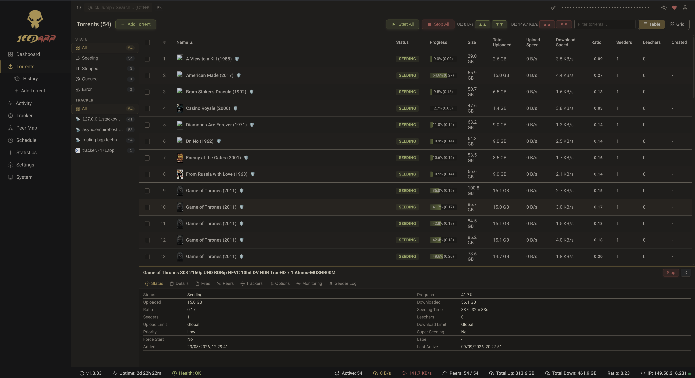

# Seedarr

  
   
  

  <strong>BitTorrent Seeding Simulator</strong> &mdash; the *arr-family approach to maintaining your ratio

  
  
  
  
  
  
  
  
  

---

## What is Seedarr?

Seedarr is a **BitTorrent seeding simulator** built on the proven Sonarr/Radarr architecture. It simulates realistic seeding behavior across trackers without transferring actual data &mdash; maintaining your ratio, keeping torrents alive, and looking indistinguishable from a real BitTorrent client.

Think of it as Sonarr for seeding: a polished web UI, REST API, real-time updates via SignalR, and deep integration with the \*arr ecosystem.

  

### Why Seedarr?

| Problem                                    | Seedarr Solution                                 |
| ------------------------------------------ | ------------------------------------------------ |
| Ratio requirements on private trackers     | Simulates realistic upload traffic patterns      |
| Need to keep rare torrents alive           | Announces to trackers and responds to peers      |
| Running a real client wastes bandwidth     | Zero actual data transfer                        |
| Manual ratio management is tedious         | Automated scheduling, distribution, and profiles |
| Want integration with Sonarr/Radarr/Lidarr | Native \*arr API integration for auto-seeding    |

---

## Key Features

### ⚡ Seeding Simulation & Swarm Behavior

- **Realistic Client Emulation:** Impersonates qBittorrent, Deluge, Transmission, uTorrent, and BiglyBT with authentic peer IDs, handshake keys, and protocol extensions.
- **Traffic Pattern Simulation:** Configurable upload/download speeds, burst/idle states, congestion modeling, and priority weighting.
- **Statistical Speed Distribution:** Pareto (80/20), Power Law, Log-Normal, and Equal distribution algorithms.
- **24/7 Speed Scheduling:** Time-of-day and day-of-week throttling schedules and speed limits.
- **Built-in Tracker Server:** Lightweight embedded HTTP & UDP tracker server for local swarms.

### 🌐 Comprehensive BitTorrent Protocol Suite

- **Tracker Protocols:** HTTP & UDP tracker announce and scrape (BEP 3, BEP 15) with multi-tracker tier failover (BEP 12).
- **Peer Wire Protocol:** Full TCP peer connections, real handshake negotiations, and message parsing.
- **MSE/PE Stream Encryption:** Diffie-Hellman 768-bit key exchange and RC4 stream cipher.
- **Distributed Networks:** DHT distributed hash table (BEP 5), Peer Exchange (BEP 11), and Local Peer Discovery (BEP 14).
- **Extensions & Transport:** Metadata Exchange / `ut_metadata` (BEP 9), Fast Extension (BEP 6), and uTP transport (BEP 29).

### 🔌 Servarr (*arr) Integration & Download Clients

- **Sonarr, Radarr & Lidarr Sync:** Connects to existing \*arr libraries to automatically grab and seed completed torrent history.
- **Download Client Integration:** Monitors active downloads in qBittorrent, Transmission, and Deluge.
- **Native REST API v1 & SignalR:** Real-time push updates for torrent states, tracker pulses, speed charts, and health checks.
- **Automated Backup & Health Monitoring:** Built-in scheduled database backups, Polly retry resilience, and system diagnostics.

---

## Documentation & Changelog

- [Changelog & Version History](CHANGELOG.md)
- [Architecture Guide](docs/architecture.md)
- [Domain Model](docs/domain-model.md)
- [BitTorrent Protocols](docs/protocols.md)
- [REST API Reference](docs/api.md)
- [Development & Setup Guide](docs/development.md)

---

## License

Distributed under the **Apache License 2.0**. See [LICENSE](LICENSE) for details.

---

  Built with the <a href="https://github.com/Sonarr/Sonarr">Sonarr</a>/<a href="https://github.com/Radarr/Radarr">Radarr</a> architecture pattern
   
  Part of the *arr family of applications
   
  <a href="https://www.seedarr.net">www.seedarr.net</a>

