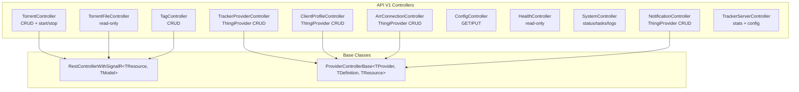

# Seedarr REST API V1

Base URL: `http://localhost:9898/api/v1`

## API Architecture

## Endpoints

### Torrents

| Method | Path | Description |
|--------|------|-------------|
| GET | `/api/v1/torrent` | List all torrents |
| GET | `/api/v1/torrent/{id}` | Get torrent by ID |
| POST | `/api/v1/torrent` | Add torrent (multipart .torrent file or magnet URI) |
| PUT | `/api/v1/torrent/{id}` | Update torrent settings |
| DELETE | `/api/v1/torrent/{id}` | Remove torrent |
| POST | `/api/v1/torrent/{id}/start` | Start seeding |
| POST | `/api/v1/torrent/{id}/stop` | Stop seeding |

### Torrent Files

| Method | Path | Description |
|--------|------|-------------|
| GET | `/api/v1/torrentfile?torrentId={id}` | List files in torrent |

### Tracker Providers (ThingiProvider)

| Method | Path | Description |
|--------|------|-------------|
| GET | `/api/v1/trackerprovider` | List configured trackers |
| GET | `/api/v1/trackerprovider/{id}` | Get tracker by ID |
| POST | `/api/v1/trackerprovider` | Add tracker |
| PUT | `/api/v1/trackerprovider/{id}` | Update tracker |
| DELETE | `/api/v1/trackerprovider/{id}` | Remove tracker |
| POST | `/api/v1/trackerprovider/test` | Test tracker connection |
| GET | `/api/v1/trackerprovider/schema` | Get provider schemas |

### Client Profiles (ThingiProvider)

| Method | Path | Description |
|--------|------|-------------|
| GET | `/api/v1/clientprofile` | List client profiles |
| POST | `/api/v1/clientprofile` | Add profile |
| PUT | `/api/v1/clientprofile/{id}` | Update profile |
| DELETE | `/api/v1/clientprofile/{id}` | Remove profile |

### *arr Connections (ThingiProvider)

| Method | Path | Description |
|--------|------|-------------|
| GET | `/api/v1/arrconnection` | List *arr connections |
| POST | `/api/v1/arrconnection` | Add connection |
| PUT | `/api/v1/arrconnection/{id}` | Update connection |
| DELETE | `/api/v1/arrconnection/{id}` | Remove connection |
| POST | `/api/v1/arrconnection/test` | Test connection |

### Configuration

| Method | Path | Description |
|--------|------|-------------|
| GET | `/api/v1/config/host` | Get host config |
| PUT | `/api/v1/config/host` | Update host config |
| GET | `/api/v1/config/seeding` | Get seeding config |
| PUT | `/api/v1/config/seeding` | Update seeding config |

### System

| Method | Path | Description |
|--------|------|-------------|
| GET | `/api/v1/system/status` | Application status |
| GET | `/api/v1/system/task` | List scheduled tasks |
| GET | `/api/v1/health` | Health check results |
| GET | `/api/v1/log` | Query logs |
| GET | `/api/v1/tag` | List tags |
| POST | `/api/v1/tag` | Create tag |
| DELETE | `/api/v1/tag/{id}` | Delete tag |
| POST | `/api/v1/command` | Execute command |
| GET | `/api/v1/command/{id}` | Get command status |

### Tracker Server

| Method | Path | Description |
|--------|------|-------------|
| GET | `/api/v1/trackerserver/stats` | Tracker server statistics |
| GET | `/api/v1/trackerserver/config` | Tracker server config |
| PUT | `/api/v1/trackerserver/config` | Update tracker server config |

## SignalR

Single hub at `/signalr/messages`

Events broadcast on entity changes:
- `torrent` - torrent added/updated/removed
- `torrentfile` - file list updated
- `health` - health check results
- `command` - command progress/completion
- `config` - configuration changed

## Authentication

API key via `X-Api-Key` header or `apikey` query parameter. Configured in host settings.
