# Seedarr REST API V1

Base URL: `http://localhost:9898/api/v1`

## API Architecture

```mermaid
graph TD
    subgraph "API V1 Controllers"
        TC[TorrentController<br/>CRUD + upload + announce]
        ACC[ArrConnectionController<br/>CRUD + test + sync]
        ASC[ArrSyncController<br/>sync trigger]
        WHC[WebhookReceiverController<br/>arr webhook]
        BC[BackupController<br/>CRUD + download + restore]
        CC[ConfigController x10<br/>GET/PUT per section]
        DSC[DiskSpaceController<br/>read-only]
        DCC[DownloadClientController<br/>CRUD + test]
        HC[HealthController<br/>read-only]
        IC[IndexerController<br/>CRUD + test]
        NC[NetworkController<br/>status + addresses]
        SDC[SeedingController<br/>stats + start/stop]
        SSC[SpeedScheduleController<br/>CRUD + active]
        LC[LogController<br/>read-only]
        LFC[LogFileController<br/>list + download]
        SC[SystemController<br/>status + tasks + commands]
        TC2[TagController<br/>CRUD]
        TSC[TrackerServerController<br/>stats + torrents + peers]
        UC[UpdateController<br/>read-only]
    end

    subgraph "Base Classes"
        REST["RestControllerWithSignalR&lt;TResource, TModel&gt;"]
        CTRL["V1ApiController (ApiController base)"]
    end

    TC --> REST
    TC2 --> CTRL
    ACC --> CTRL
    CC --> CTRL
```

## Endpoints

### Torrents (`/api/v1/torrent`)

| Method | Path                            | Description                                        |
| ------ | ------------------------------- | -------------------------------------------------- |
| GET    | `/torrent`                      | List all torrents                                  |
| GET    | `/torrent/{id}`                 | Get torrent by ID                                  |
| POST   | `/torrent`                      | Add torrent (JSON body with optional `magnetLink`) |
| POST   | `/torrent/upload`               | Upload .torrent file (multipart/form-data)         |
| PUT    | `/torrent/{id}`                 | Update torrent settings                            |
| DELETE | `/torrent/{id}`                 | Remove torrent (`?deleteFiles=true/false`)         |
| GET    | `/torrent/{torrentId}/files`    | List files in torrent                              |
| GET    | `/torrent/{torrentId}/trackers` | List tracker entries for torrent                   |
| GET    | `/torrent/{torrentId}/peers`    | List connected peers for torrent                   |
| POST   | `/torrent/{id}/announce`        | Force re-announce to all trackers                  |
| POST   | `/torrent/{id}/recheck`         | Force recheck/verify torrent                       |
| PUT    | `/torrent/{id}/queue`           | Move torrent queue position (`{ "position": N }`)  |

### Seeding (`/api/v1/seeding`)

| Method | Path                           | Description                        |
| ------ | ------------------------------ | ---------------------------------- |
| GET    | `/seeding/stats`               | Aggregate seeding statistics       |
| GET    | `/seeding/history`             | Global speed history snapshots     |
| GET    | `/seeding/history/{torrentId}` | Speed history for specific torrent |
| POST   | `/seeding/start/{torrentId}`   | Start seeding a torrent            |
| POST   | `/seeding/stop/{torrentId}`    | Stop seeding a torrent             |
| POST   | `/seeding/start-all`           | Start seeding all torrents         |
| POST   | `/seeding/stop-all`            | Stop seeding all torrents          |

### Speed Schedules (`/api/v1/speedschedule`)

| Method | Path                    | Description                       |
| ------ | ----------------------- | --------------------------------- |
| GET    | `/speedschedule`        | List all speed schedules          |
| GET    | `/speedschedule/{id}`   | Get schedule by ID                |
| GET    | `/speedschedule/active` | Get currently active speed limits |
| POST   | `/speedschedule`        | Create speed schedule             |
| PUT    | `/speedschedule/{id}`   | Update speed schedule             |
| DELETE | `/speedschedule/{id}`   | Delete speed schedule             |

### *arr Connections (`/api/v1/arrconnections`)

| Method | Path                        | Description                              |
| ------ | --------------------------- | ---------------------------------------- |
| GET    | `/arrconnections`           | List all arr connections                 |
| GET    | `/arrconnections/{id}`      | Get connection by ID                     |
| POST   | `/arrconnections`           | Create connection (registers webhook)    |
| PUT    | `/arrconnections/{id}`      | Update connection (re-registers webhook) |
| DELETE | `/arrconnections/{id}`      | Delete connection (unregisters webhook)  |
| POST   | `/arrconnections/{id}/test` | Test connectivity to arr instance        |
| POST   | `/arrconnections/sync`      | Trigger full sync across all connections |

### *arr Sync (`/api/v1/arrsync`)

| Method | Path            | Description      |
| ------ | --------------- | ---------------- |
| POST   | `/arrsync/sync` | Trigger arr sync |

### Webhook (`/api/v1/webhook`)

| Method | Path           | Description                               |
| ------ | -------------- | ----------------------------------------- |
| POST   | `/webhook/arr` | Receive webhook from Sonarr/Radarr/Lidarr |

### Backup (`/api/v1/backup`)

| Method | Path                    | Description                                   |
| ------ | ----------------------- | --------------------------------------------- |
| GET    | `/backup`               | List all backups                              |
| POST   | `/backup`               | Create backup                                 |
| DELETE | `/backup/{id}`          | Delete backup (`?fileName=` optional)         |
| GET    | `/backup/{id}/download` | Download backup as ZIP                        |
| POST   | `/backup/restore`       | Restore from backup (`{ "fileName": "..." }`) |

### Configuration (`/api/v1/config/{section}`)

10 config sections, each with GET and PUT:

| Section        | Route                   | Key Settings                                                                                       |
| -------------- | ----------------------- | -------------------------------------------------------------------------------------------------- |
| General        | `/config/general`       | autoStart, theme, colorScheme, watchFolder, port, bindAddress, urlBase, apiKey                     |
| Seeding        | `/config/seeding`       | maxUploadSpeedKbps, maxDownloadSpeedKbps, altSpeeds, globalSeedRatioLimit, distribution algorithms |
| BitTorrent     | `/config/bittorrent`    | enableDht, enablePex, enableLpd, encryptionMode, peerIdPrefix, userAgent                           |
| Network        | `/config/network`       | listeningPort, upnpEnabled, connection limits, proxy settings                                      |
| Peer Protocol  | `/config/peerprotocol`  | handshake/message/keepAlive timeouts, peerRequestCount, dropout probabilities                      |
| Protocols      | `/config/protocols`     | ut_metadata, ut_pex, lt_dont_have, fast extension, uTP, multi-tracker, DHT                         |
| Simulation     | `/config/simulation`    | clientBehaviorEngine, primaryClient, behaviorVariation, traffic patterns, swarm intelligence       |
| Tracker Server | `/config/trackerserver` | HTTP/UDP enable/port, announce interval, max peers, rate limiting                                  |
| Scheduler      | `/config/scheduler`     | enabled, start/end hour+minute, per-day-of-week booleans                                           |
| Advanced       | `/config/advanced`      | logToFile, fileLogLevel, debugMode, uiRefreshRateSec                                               |

### Download Clients (`/api/v1/downloadclients`)

| Method | Path                         | Description                                         |
| ------ | ---------------------------- | --------------------------------------------------- |
| GET    | `/downloadclients`           | List all download clients                           |
| GET    | `/downloadclients/{id}`      | Get download client by ID                           |
| POST   | `/downloadclients`           | Create download client                              |
| PUT    | `/downloadclients/{id}`      | Update download client                              |
| DELETE | `/downloadclients/{id}`      | Delete download client                              |
| POST   | `/downloadclients/{id}/test` | Test connection (qBittorrent, Transmission, Deluge) |

### Indexers (`/api/v1/indexers`)

| Method | Path                  | Description                                  |
| ------ | --------------------- | -------------------------------------------- |
| GET    | `/indexers`           | List all indexers                            |
| GET    | `/indexers/{id}`      | Get indexer by ID                            |
| POST   | `/indexers`           | Create indexer                               |
| PUT    | `/indexers/{id}`      | Update indexer                               |
| DELETE | `/indexers/{id}`      | Delete indexer                               |
| POST   | `/indexers/{id}/test` | Test connection (Prowlarr, Torznab, Newznab) |

### Tracker Server (`/api/v1/trackerserver`)

| Method | Path                                       | Description                                                    |
| ------ | ------------------------------------------ | -------------------------------------------------------------- |
| GET    | `/trackerserver/stats`                     | Tracker server statistics (totalTorrents, totalPeers, uptime)  |
| GET    | `/trackerserver/torrents`                  | List tracked torrents (infoHash, peerCount, seeders, leechers) |
| GET    | `/trackerserver/torrents/{infoHash}/peers` | Peers for specific tracked torrent                             |

### System (`/api/v1/system`)

| Method | Path              | Description                                                        |
| ------ | ----------------- | ------------------------------------------------------------------ |
| GET    | `/system/status`  | App status (version, OS, runtime, startTime, paths, isDocker)      |
| GET    | `/system/task`    | Scheduled tasks (typeName, interval, lastExecution, nextExecution) |
| GET    | `/system/command` | Queued/running commands (id, name, status, duration)               |

### Health (`/api/v1/health`)

| Method | Path      | Description                      |
| ------ | --------- | -------------------------------- |
| GET    | `/health` | Run and return all health checks |

### Network (`/api/v1/network`)

| Method | Path                 | Description             |
| ------ | -------------------- | ----------------------- |
| GET    | `/network/status`    | Current network status  |
| GET    | `/network/addresses` | Local network addresses |

### Logs (`/api/v1/log`, `/api/v1/logfile`)

| Method | Path                  | Description                                           |
| ------ | --------------------- | ----------------------------------------------------- |
| GET    | `/log`                | In-memory log entries (`?level=`&`?count=`, max 5000) |
| GET    | `/logfile`            | List log files on disk                                |
| GET    | `/logfile/{filename}` | Download log file as text/plain                       |
| DELETE | `/logfile`            | Delete all log files except active log                |

### Tags (`/api/v1/tag`)

| Method | Path        | Description   |
| ------ | ----------- | ------------- |
| GET    | `/tag`      | List all tags |
| GET    | `/tag/{id}` | Get tag by ID |
| POST   | `/tag`      | Create tag    |
| PUT    | `/tag`      | Update tag    |
| DELETE | `/tag/{id}` | Delete tag    |

### Disk Space (`/api/v1/diskspace`)

| Method | Path         | Description                       |
| ------ | ------------ | --------------------------------- |
| GET    | `/diskspace` | Disk space for all relevant paths |

### Updates (`/api/v1/update`)

| Method | Path      | Description                 |
| ------ | --------- | --------------------------- |
| GET    | `/update` | Check for available updates |

## SignalR

Single hub at `/signalr/messages`

Client event name: `receiveMessage`

Message format:

- `Name` (string) - resource name
- `Body` (object) - resource payload

Events broadcast:

- `torrent` - torrent added/updated/deleted (only model with SignalR via `RestControllerWithSignalR`)
- `version` - sent to each client on connection with current version

## Authentication

API key via `X-Api-Key` header or `apikey` query parameter. Configured in general settings.
