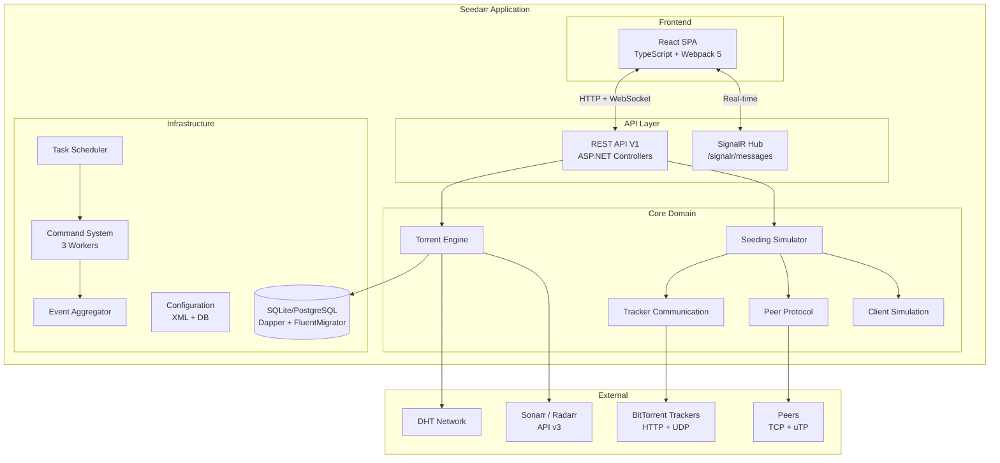
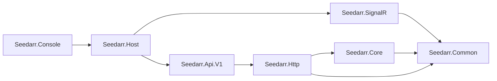
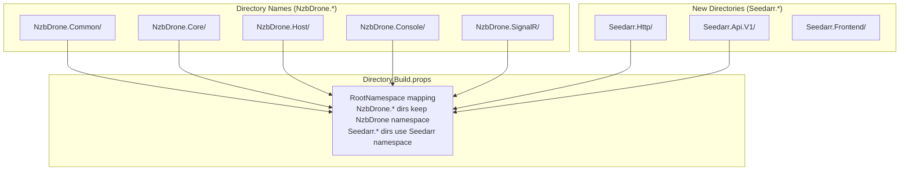
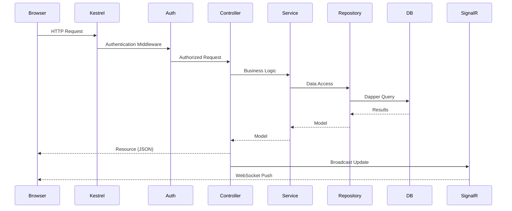
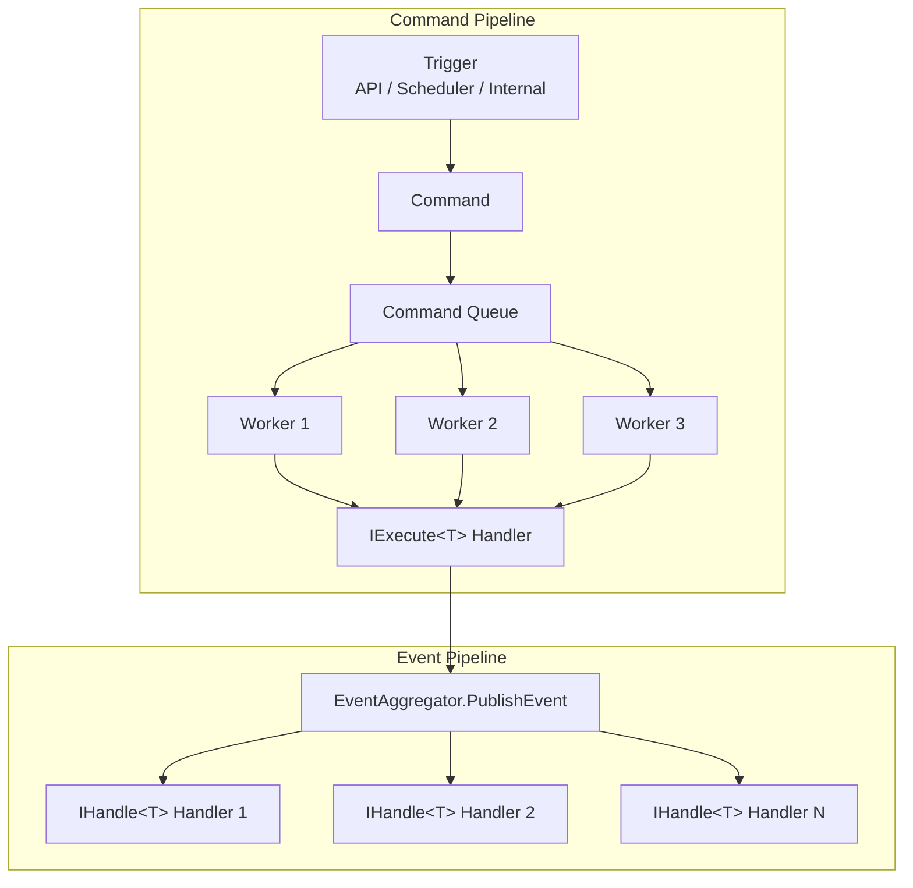
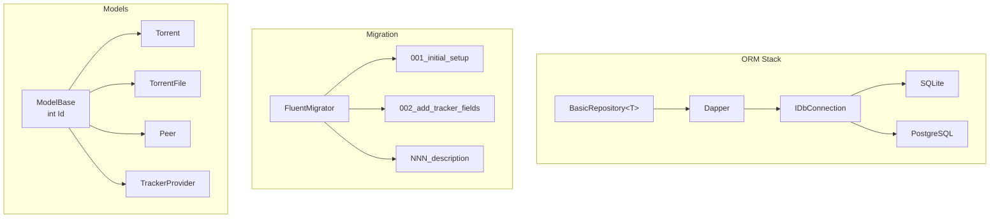

# Seedarr Architecture

## System Overview

Seedarr is a BitTorrent seeding simulator built on the *arr-family (Sonarr/Radarr) application framework. It simulates seeding activity for torrent files without transferring real data.

## Project Dependency Graph

| Project | Directory | Responsibility |
|---------|-----------|----------------|
| Seedarr.Common | `NzbDrone.Common/` | DI container, logging, HTTP utilities, disk operations, serialization, caching |
| Seedarr.Core | `NzbDrone.Core/` | All domain logic: torrents, seeding, trackers, peers, protocols, simulation |
| Seedarr.SignalR | `NzbDrone.SignalR/` | Single SignalR hub for real-time browser updates |
| Seedarr.Http | `Seedarr.Http/` | REST framework, middleware, auth, versioned routing |
| Seedarr.Api.V1 | `Seedarr.Api.V1/` | API controllers (one per resource) |
| Seedarr.Host | `NzbDrone.Host/` | Kestrel web server, startup pipeline, middleware registration |
| Seedarr.Console | `NzbDrone.Console/` | Console entry point, restart loop |
| Seedarr.Frontend | `Seedarr.Frontend/` | React SPA |

## NzbDrone Fork Pattern

## Request Flow

## Command/Event System

## DI Container (DryIoc)

Auto-registration rules:
- **Interfaces** registered as **Singleton** (one instance per application lifetime)
- **Concrete classes** registered as **Transient** (new instance per resolution)
- No manual wiring needed for standard services
- Convention: `IFooService` + `FooService` auto-matched by DryIoc scanner

## Database Layer

