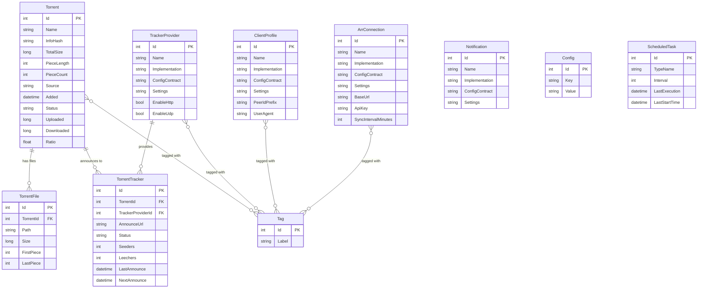
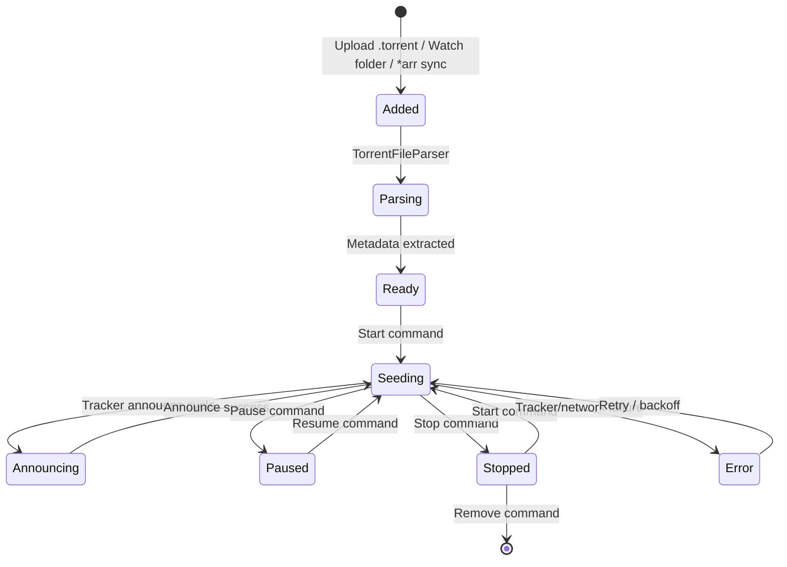
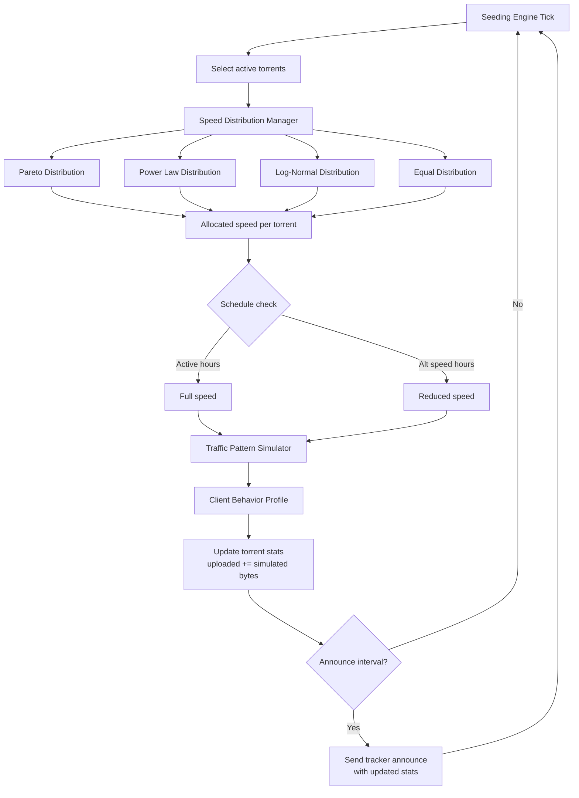
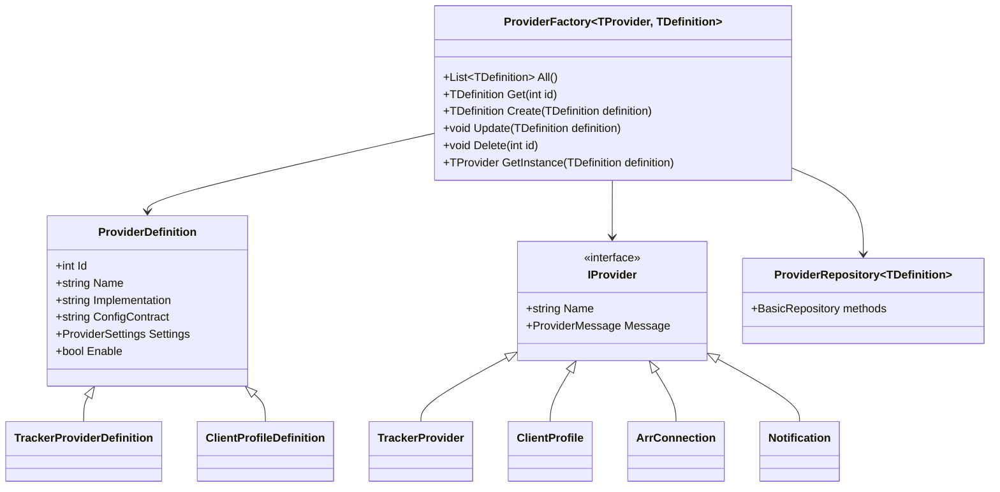

# Seedarr Domain Model

## Entity Relationship Diagram

## Torrent Lifecycle

## Seeding Simulation Flow

## ThingiProvider Pattern

Used for pluggable components (Trackers, ClientProfiles, ArrConnections, Notifications).

