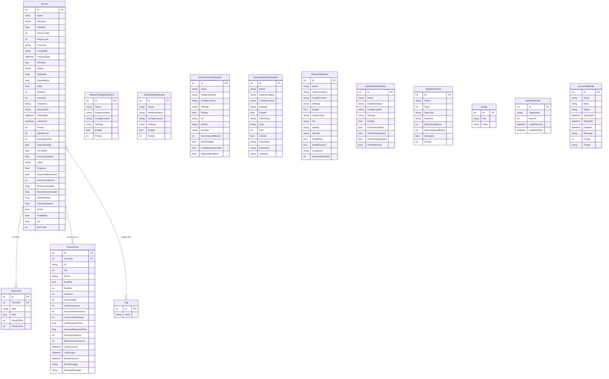
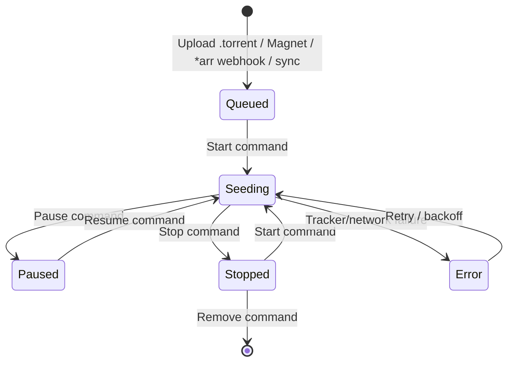
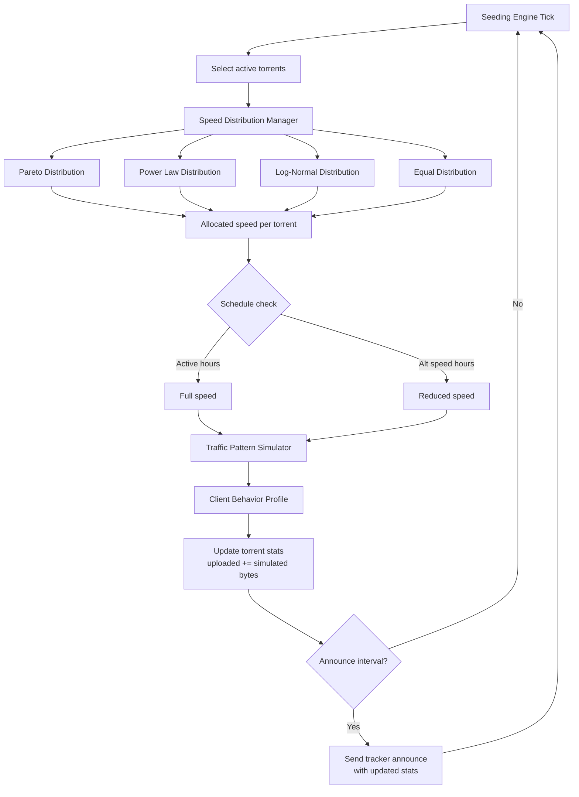
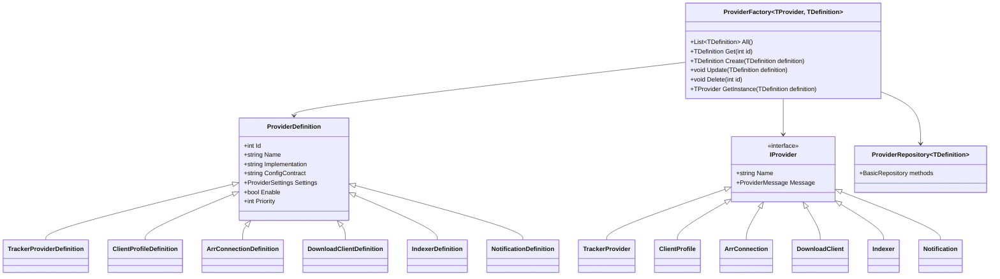

# Seedarr Domain Model

## Entity Relationship Diagram

## Torrent Status Enum

| Value | Description |
|-------|-------------|
| `Stopped` | Not seeding |
| `Seeding` | Actively simulating upload |
| `Paused` | Temporarily paused |
| `Error` | Tracker/network failure |
| `Queued` | Waiting to start |
| `Downloading` | Simulating download |

## Torrent Lifecycle

## In-Memory Models (Not Persisted)

These exist only at runtime, not in the database:

- **PeerConnection** (`NzbDrone.Core/Peers/PeerConnection.cs`) — active TCP peer connection with handshake state, message framing, encryption
- **DhtNode** (`NzbDrone.Core/Dht/`) — DHT routing table node
- **DhtPeerStore** — in-memory peer store with 30-minute TTL
- **TrackerServerPeerDatabase** — built-in tracker's peer registry (ConcurrentDictionary with TTL)

## Seeding Simulation Flow

## ThingiProvider Pattern

Used for pluggable components (TrackerProviders, ClientProfiles, ArrConnections, DownloadClients, Indexers, Notifications).

## Table Registration

Entity-to-table mapping defined in `NzbDrone.Core/Datastore/TableRegistration.cs`:

| Entity Class | Table Name |
|-------------|------------|
| Torrent | Torrents |
| TorrentFile | TorrentFiles |
| TrackerEntry | TrackerEntries |
| TrackerProviderDefinition | TrackerProviderDefinitions |
| ClientProfileDefinition | ClientProfileDefinitions |
| ArrConnectionDefinition | ArrConnectionDefinitions |
| DownloadClientDefinition | DownloadClientDefinitions |
| IndexerDefinition | IndexerDefinitions |
| NotificationDefinition | NotificationDefinitions |
| SpeedSchedule | SpeedSchedules |
| Tag | Tags |
| ConfigModel | Config |
| ScheduledTask | ScheduledTasks |
| CommandModel | Commands |
