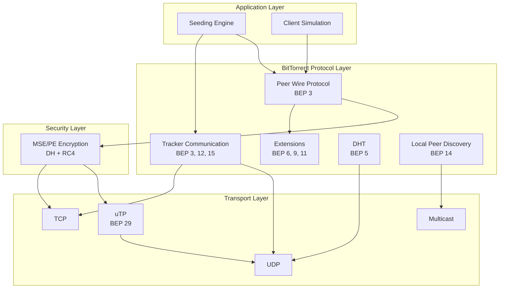
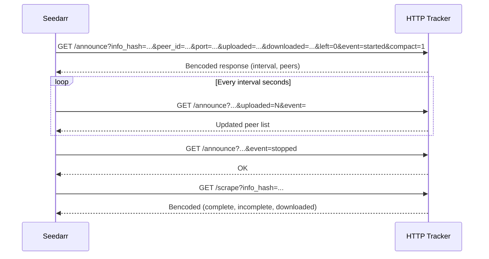
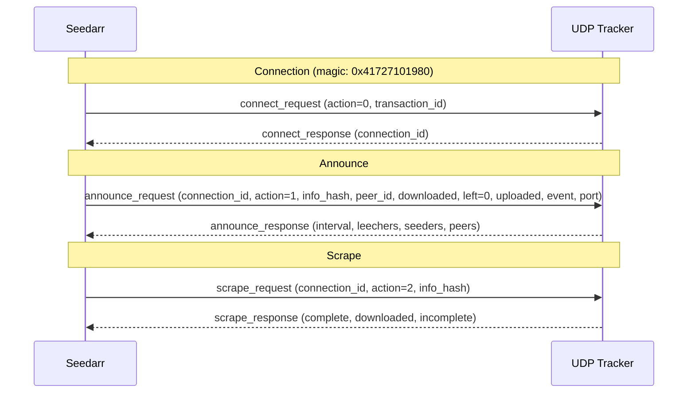
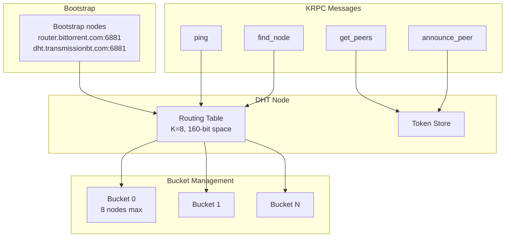
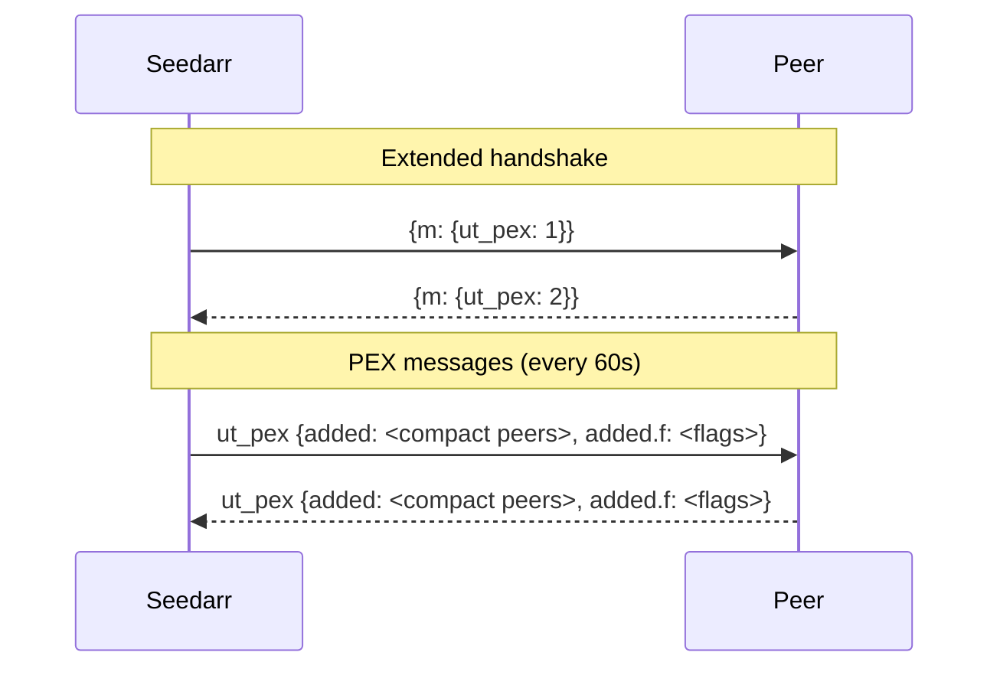
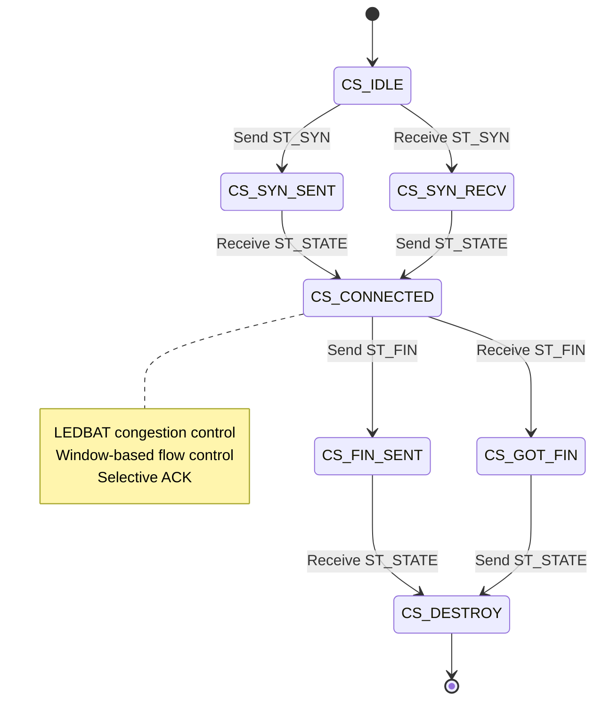
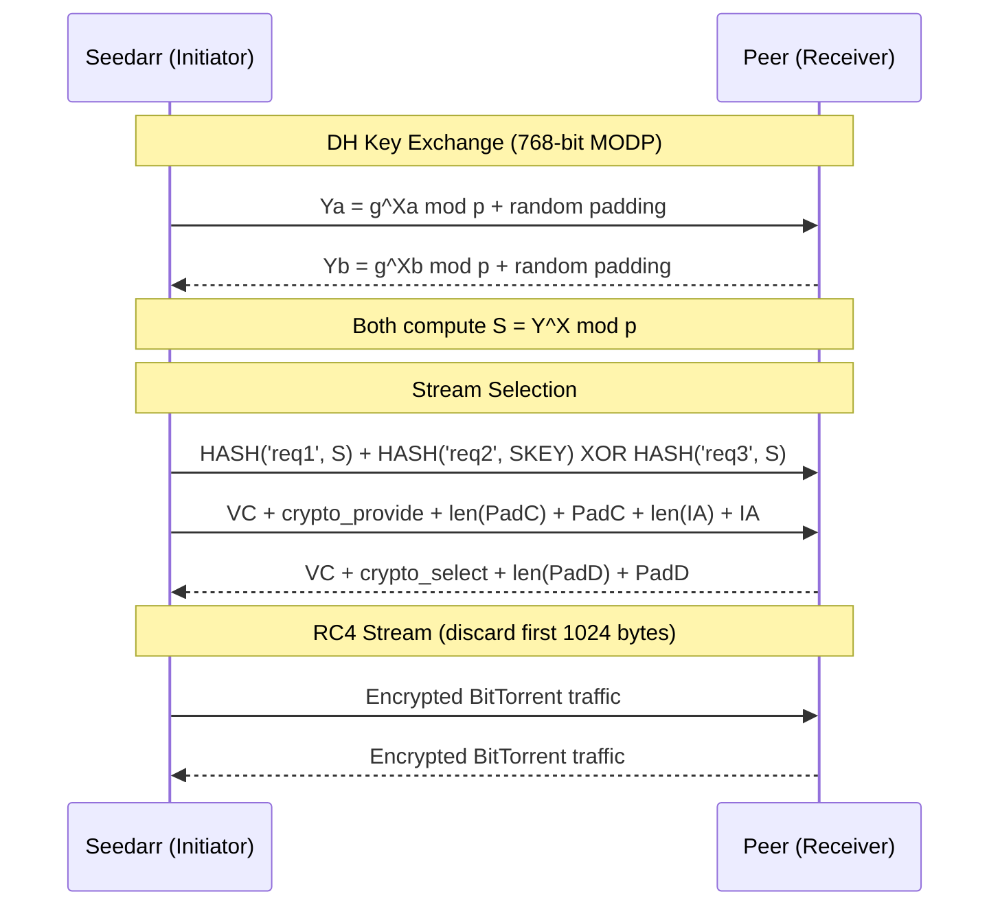
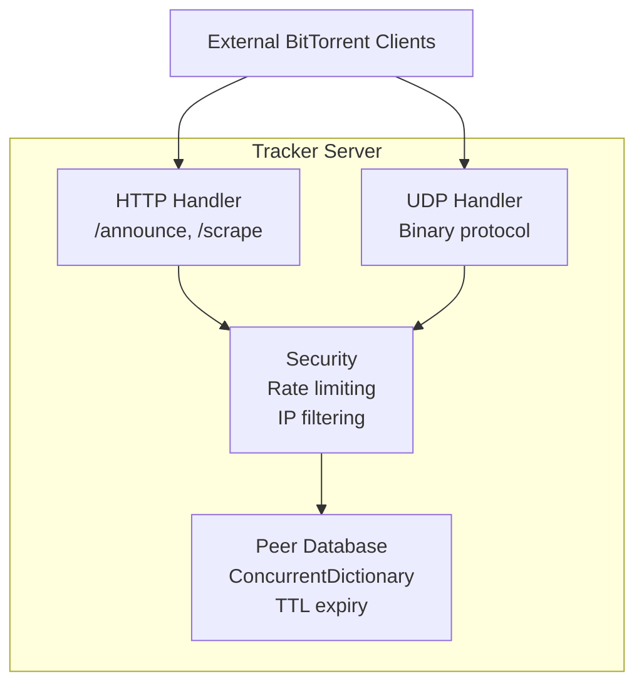

# BitTorrent Protocol Implementations

## Protocol Stack

## BEP Implementations

### BEP 3: HTTP Tracker Protocol

### BEP 15: UDP Tracker Protocol

### BEP 5: DHT (Distributed Hash Table)

### BEP 11: Peer Exchange (PEX)

### BEP 29: uTP (Micro Transport Protocol)

### MSE/PE Encryption

## Client Behavior Profiles

| Profile | Peer ID | User Agent | Behavior |
|---------|---------|------------|----------|
| qBittorrent 4.4.2 | `-qB4420-` | `qBittorrent/4.4.2` | Aggressive seeding, fast piece selection |
| Deluge 2.0.3 | `-DE2030-` | `Deluge 2.0.3` | Balanced, moderate announce frequency |
| Transmission 3.0 | `-TR3000-` | `Transmission/3.00` | Conservative, strict rate limiting |
| uTorrent 3.5.5 | `-UT3550-` | `uTorrent/3550` | Chatty announces, PEX heavy |
| BiglyBT | `-BG` prefix | `BiglyBT` | DHT focused, large swarm handling |

## Built-in Tracker Server

