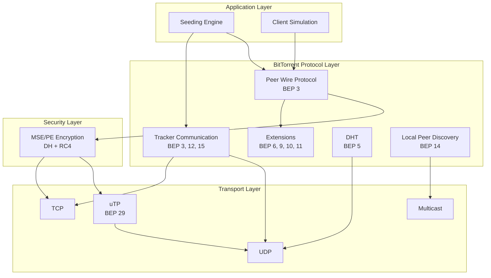
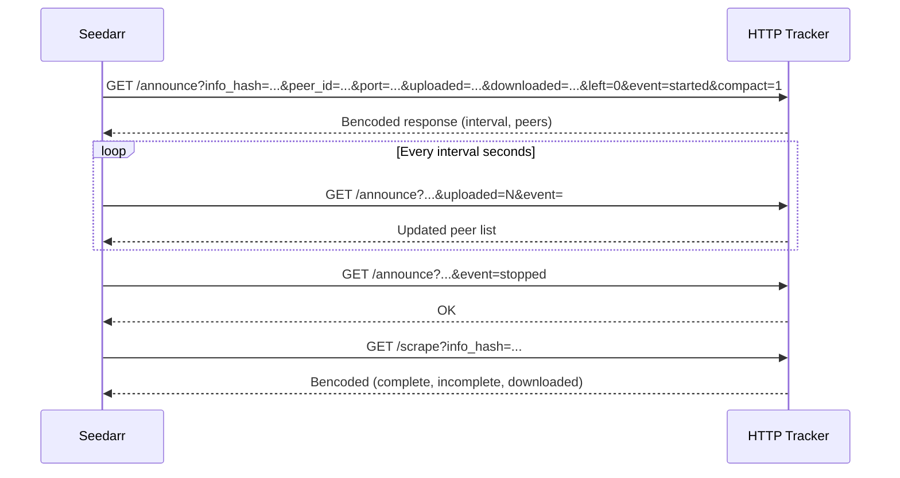
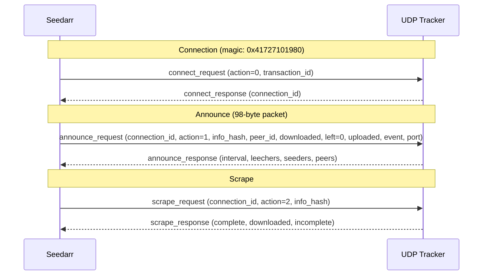
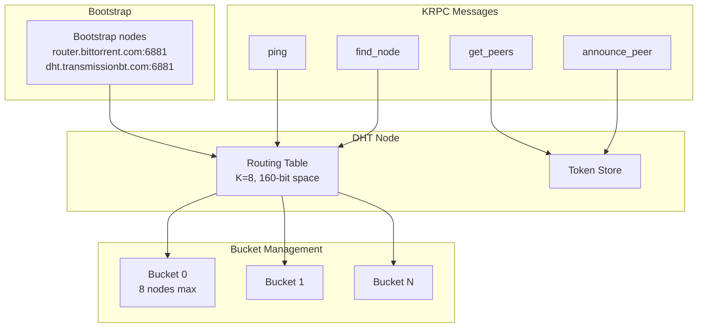
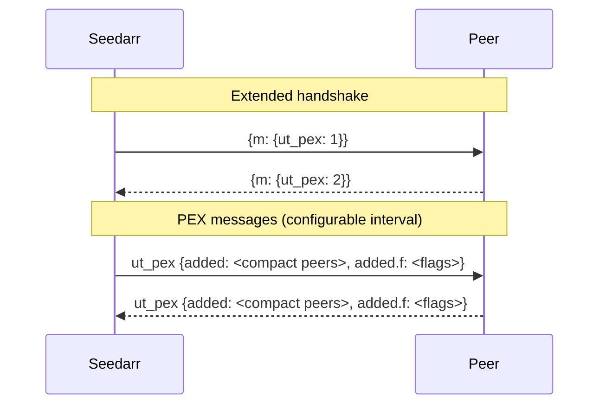
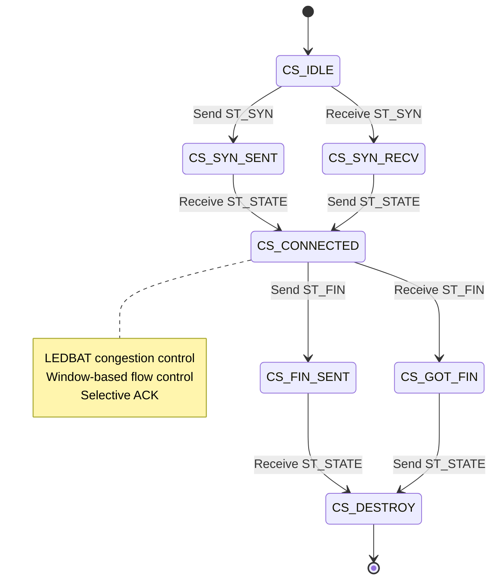
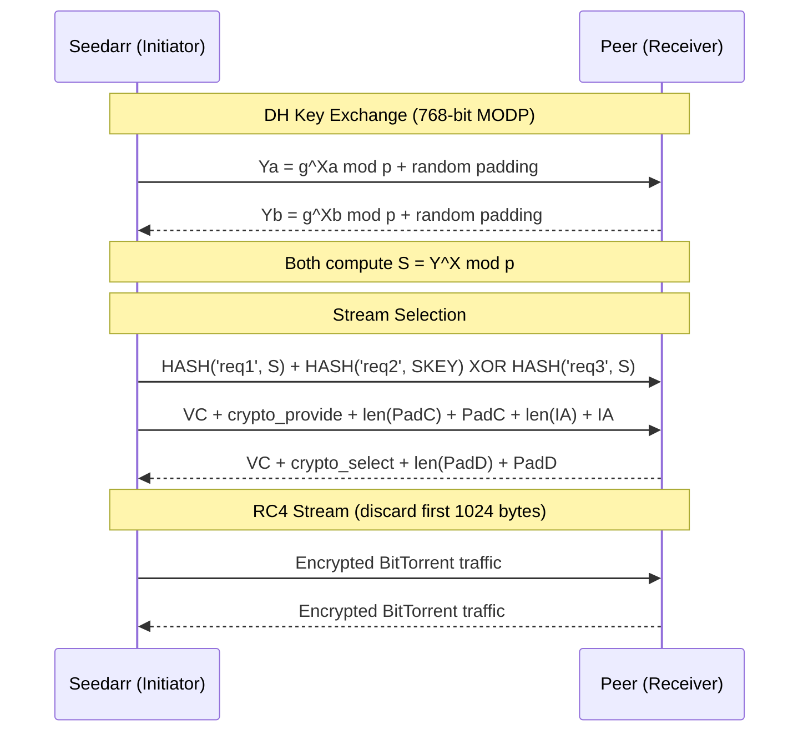
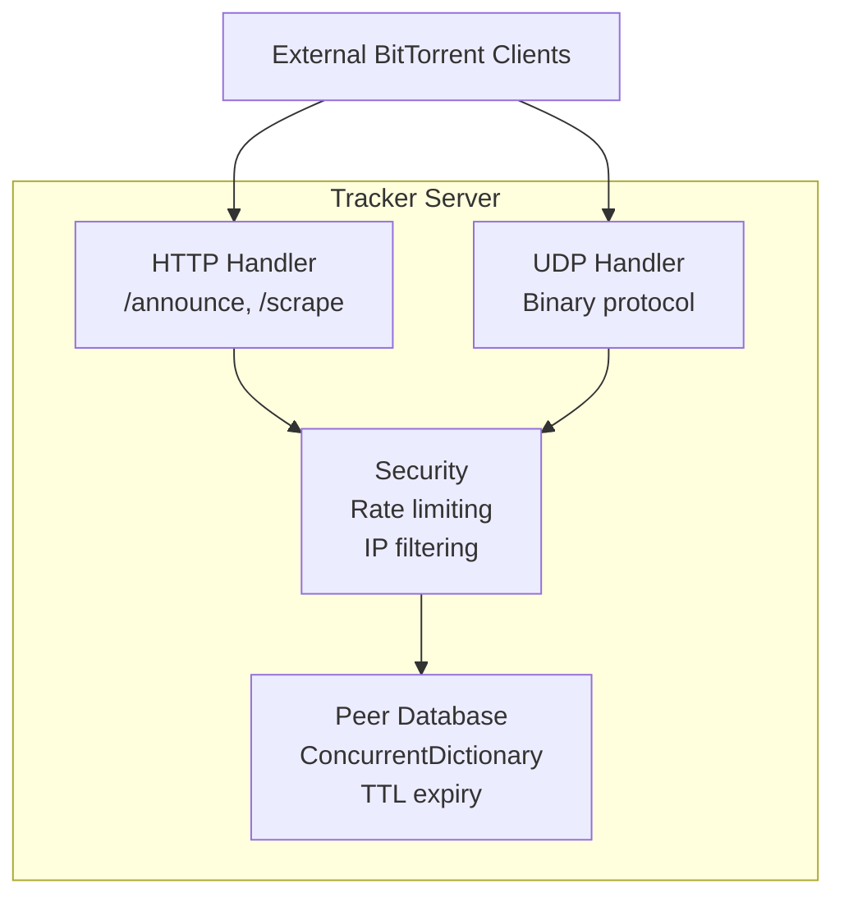

# BitTorrent Protocol Implementations

## Protocol Stack

## BEP Implementations

### BEP 3: BitTorrent Protocol (Peer Wire + HTTP Tracker)

**Peer Wire Protocol** (`NzbDrone.Core/Peers/PeerConnection.cs`):

- 68-byte handshake: pstrlen (1) + "BitTorrent protocol" (19) + reserved (8) + info_hash (20) + peer_id (20)
- All standard message types: Choke (0), Unchoke (1), Interested (2), NotInterested (3), Have (4), Bitfield (5), Request (6), Piece (7), Cancel (8), Port (9), Extended (20)
- `PeerServer` runs as BackgroundService, accepts incoming TCP connections, serves fake piece data (zeros)
- `ConnectionManager` manages peer connections with LRU eviction, per-torrent limits, dropout simulation

**HTTP Tracker** (`NzbDrone.Core/Trackers/Http/HttpTrackerProvider.cs`):

### BEP 15: UDP Tracker Protocol

`NzbDrone.Core/Trackers/Udp/UdpTrackerProvider.cs`

### BEP 5: DHT (Distributed Hash Table)

`NzbDrone.Core/Dht/DhtService.cs` + `RoutingTable.cs` + `DhtPeerStore.cs`

- All four KRPC queries: `ping`, `find_node`, `get_peers`, `announce_peer`
- Compact node encoding (26 bytes: 20-byte node ID + 4-byte IP + 2-byte port)
- Token generation/validation with secret rotation (10-minute intervals, accepts current + previous)
- `implied_port` support
- K-bucket routing table (configurable bucket size, default K=8), XOR distance metric, bad-node eviction
- In-memory peer store with 30-minute TTL
- Bootstrap: `router.bittorrent.com:6881`, `dht.transmissionbt.com:6881`

### BEP 6: Fast Extension

`NzbDrone.Core/Peers/Extensions/FastExtension.cs`

- All five message types: SuggestPiece (0x0D), HaveAll (0x0E), HaveNone (0x0F), RejectRequest (0x10), AllowedFast (0x11)
- BEP 6 Allowed Fast Set algorithm: SHA-1 of (/24-masked IP + infohash), iterating 4-byte chunks
- Per-peer fast set tracking

### BEP 9: Metadata Exchange (ut_metadata)

`NzbDrone.Core/Peers/Extensions/MetadataExchange.cs`

- Request/response messages using bencoded dictionaries (msg_type, piece, total_size)
- BencodeNET serialization

### BEP 10: Extension Protocol

`NzbDrone.Core/Peers/Extensions/ExtensionManager.cs`

- Extension handshake construction (bencoded `m` dictionary mapping names to IDs)
- Supported extensions (configurable): `ut_pex`, `ut_metadata`, `lt_donthave`

### BEP 11: Peer Exchange (PEX)

`NzbDrone.Core/Peers/Extensions/PeerExchange.cs`

Compact peer encoding: 6 bytes per peer (4-byte IP + 2-byte port).

### BEP 12: Multi-Tracker

`NzbDrone.Core/Trackers/MultiTracker/MultiTrackerManager.cs`

- Tiered announce list processing
- Configurable `AnnounceToAllTiers` / `AnnounceToAllInTier`
- Exponential backoff failover with consecutive failure tracking

### BEP 14: Local Peer Discovery

`NzbDrone.Core/Peers/Lpd/LocalPeerDiscovery.cs`

- Multicast on `239.192.152.143:6771`
- HTTP-style `BT-SEARCH` announce messages
- BackgroundService with 300-second announce interval

### BEP 29: uTP (Micro Transport Protocol)

`NzbDrone.Core/Transport/UtpConnection.cs` + `UtpManager.cs`

- 20-byte header: type, version, extension, connection ID, timestamps, window, sequence/ack numbers
- Packet types: Data (0), Fin (1), State (2), Reset (3), Syn (4)
- SYN/State connection establishment, data send/receive with ACK, FIN teardown
- `UtpManager` as BackgroundService with TCP fallback, max 100 connections

### MSE/PE Encryption

`NzbDrone.Core/Peers/Encryption/` (MseHandshake, MseKeyDerivation, Rc4StreamCipher, EncryptedStream)

- DH key exchange (768-bit MODP prime) via BouncyCastle
- SHA-1 key derivation with prefixes (keyA, keyB, req1, req2, req3)
- RC4 stream cipher with 1024-byte initial keystream discard
- Three modes: PreferPlainText, PreferEncrypted, RequireEncrypted
- Both outgoing and incoming negotiation

## Client Behavior Profiles

All profiles in `NzbDrone.Core/Simulation/ClientBehavior/Profiles/`. Each uses Azureus-style peer ID: 8-char prefix + 12 random decimal digits = 20 bytes.

| Profile | Peer ID Prefix | User Agent | Version | Default Port |
|---------|---------------|------------|---------|-------------|
| qBittorrent | `-qB4420-` | `qBittorrent/4.4.2` | 4.4.2 | 6881 |
| Deluge | `-DE2030-` | `Deluge/2.0.3` | 2.0.3 | 6881 |
| Transmission | `-TR3000-` | `Transmission/3.00` | 3.00 | 51413 |
| uTorrent | `-UT3550-` | `uTorrent/3.5.5` | 3.5.5 | 6881 |
| BiglyBT | `-BG2700-` | `BiglyBT/2.7.0.0` | 2.7.0.0 | 6881 |

All profiles support encryption, DHT, and PEX.

## Built-in Tracker Server

`NzbDrone.Core/TrackerServer/`

